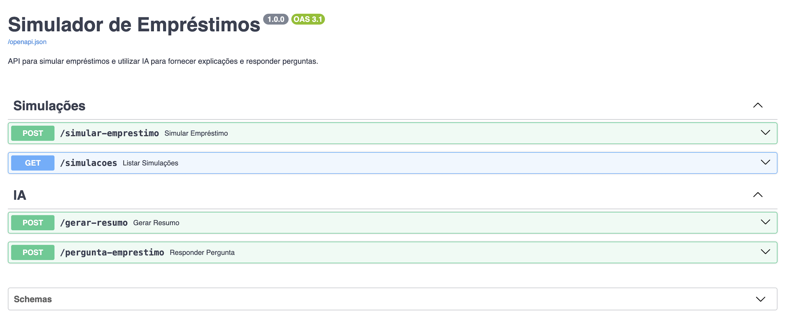

# Simulador de Empréstimos

Uma API desenvolvida com FastAPI para simular empréstimos e utilizar IA para fornecer explicações e responder perguntas sobre empréstimos.

## Funcionalidades

- Simular valores de empréstimos com base no valor, taxa de juros e número de parcelas.
- Gerar resumos explicativos sobre empréstimos utilizando IA.
- Responder perguntas relacionadas a empréstimos.

## Estrutura do Projeto

```plaintext
simulador_credito/
├── app/
│   ├── __init__.py
│   ├── create_tables.py
│   ├── database.py
│   ├── main.py
│   ├── models.py
│   ├── openai_utils.py
│   ├── schemas.py
├── screenshots/
│   └── simulador_credito.png
├── venv/ (diretório virtual do Python)
├── .env (arquivo de variáveis de ambiente)
├── .gitignore
├── requirements.txt
```

## Instalação

1. Clone o repositório:
   ```bash
   git clone <url-do-repositorio>
   cd simulador_credito
   ```

2. Crie e ative um ambiente virtual:

```
python -m venv venv
source venv/bin/activate  # Linux/Mac
venv\Scripts\activate     # Windows
```

3. Instale as dependências:
```
pip install -r requirements.txt
```

4. Configure as variáveis de ambiente no arquivo .env:
```
DATABASE_URL=postgresql://<usuario>:<senha>@<host>/<banco>
OPENAI_API_KEY=sk-xxxxxxxxxxxxxxxxxxxxxxxxxxxxxxxx
```

5. Execute o projeto:
```
uvicorn app.main:app --reload
```

6. Acesse a documentação interativa da API em: http://127.0.0.1:8000/docs

## Screenshot

Abaixo, uma visualização da estrutura do projeto:



## Endpoints

### 1. Simular Empréstimo
**POST** `/simular-emprestimo`  
Calcula os valores de um empréstimo com base no valor, taxa de juros mensal e número de parcelas.  
- **Parâmetros**:  
  - `valor_emprestimo`: float - Valor do empréstimo (exemplo: 100000).  
  - `taxa_juros`: float - Taxa de juros mensal em % (exemplo: 1.5).  
  - `num_parcelas`: int - Número de parcelas (exemplo: 36).  

### 2. Listar Simulações
**GET** `/simulacoes`  
Retorna todas as simulações registradas no banco de dados.  

### 3. Gerar Resumo
**POST** `/gerar-resumo`  
Gera um resumo explicativo sobre o empréstimo utilizando IA.  
- **Parâmetros**:  
  - `valor_emprestimo`: float - Valor do empréstimo (exemplo: 100000).  
  - `taxa_juros`: float - Taxa de juros mensal em % (exemplo: 1.5).  
  - `num_parcelas`: int - Número de parcelas (exemplo: 36).  

### 4. Responder Pergunta
**POST** `/pergunta-emprestimo`  
Responde perguntas relacionadas a empréstimos utilizando IA.  
- **Parâmetros**:  
  - `pergunta`: string - Pergunta sobre empréstimos (exemplo: "Como funciona a taxa de juros?").  

## Tecnologias Utilizadas

- **FastAPI**: Framework para desenvolvimento de APIs.  
- **SQLAlchemy**: ORM para interagir com o banco de dados.  
- **PostgreSQL**: Banco de dados utilizado.  
- **OpenAI API**: Para gerar resumos e responder perguntas.  

## Licença

Este projeto está licenciado sob a [MIT License](LICENSE).
